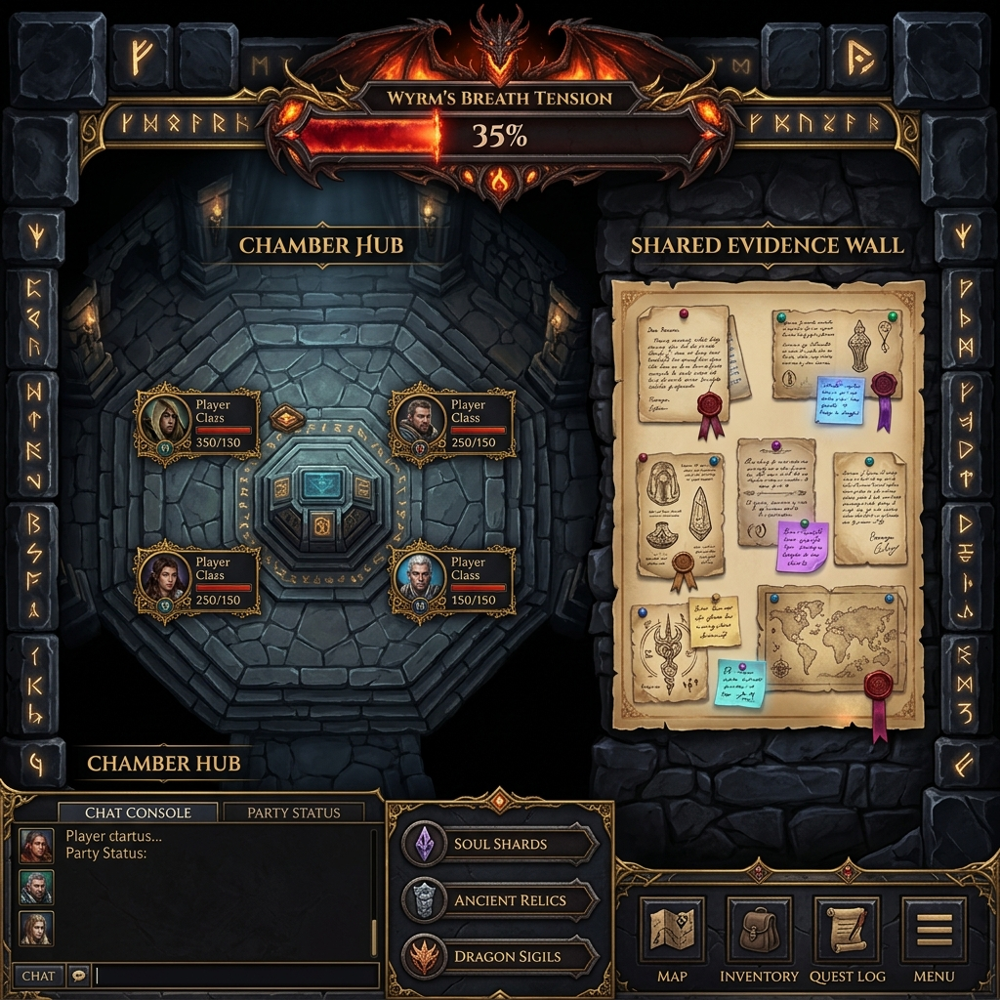
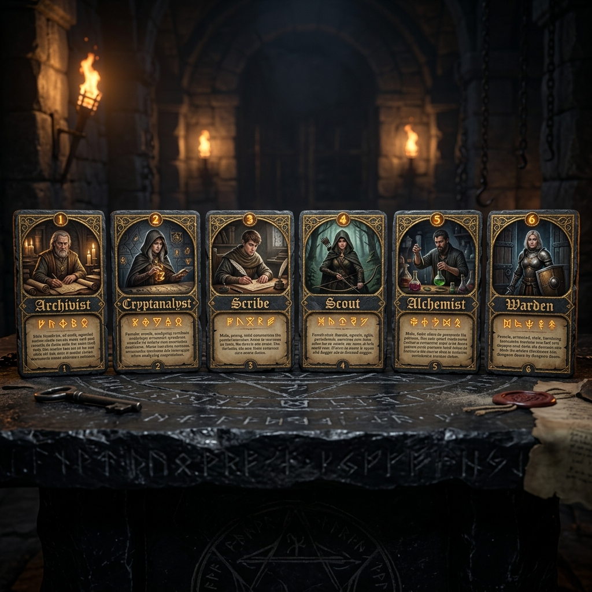

# WYRMVAULT — Canonical Game Design & Cooperative Cipher-Dungeon Platform

[](https://github.com/prakharrai12/The-Alchemist-s-Courier)
[](#)
[](#)
[](#)

**WYRMVAULT** is a cooperative browser-based cipher-dungeon game designed strictly for **4 to 6 players**. Players step into an ancient dragon-guarded stone vault (`#12110e` Obsidian / `#1c1a16` Carved Stone) where historical chambers hold encrypted correspondence ("Evidence"). To survive and claim the vault's secrets, the team must explore chambers, recover encrypted letters, decipher them using specialized cryptographic tools, pin findings to a shared **Evidence Wall**, and deduce the master **Final Key** before the **Wyrm's Breath** tension meter wakes the dragon (`100%`).

---

## 🏛️ Project Visuals & Screenshots

### 1. The Chamber Hub & Shared Evidence Wall

*Cooperative dungeon game interface featuring the Chamber Hub, shared real-time Evidence Wall with pinned illuminated parchment letters, and the authoritative Wyrm's Breath dragon tension meter (`var(--font-display)` Cinzel & `var(--font-ui)` Outfit).*

### 2. Role Select Chamber & Six Canonical Powers

*Six flippable Role Cards displayed before entering the vault. Every role grants one real, server-enforced one-time power per Case.*

### 3. Alchemical Seal Iconography

*Authentic leaded wax seals (`#8c2020` Crimson Seal → `#d4af37` Gilded Signet) used for chamber wards and verdict verification.*

---

## ⚔️ Core Gameplay Loop (`§2`)

1. **Chamber Entry**: The team enters an ancient vault chamber containing 1 to 3 sealed encrypted letters/codices.
2. **Evidence Recovery**: Any player can pick up a letter from the chamber and bring it to the **Decryption Bench (`<DecryptionBench />`)**.
3. **Cryptographic Analysis**: Players use tier-appropriate interactive tools (`Caesar shift wheel`, `Vigenère keyword matrix`, `Pigpen key grid`, `Transposition rail`) to test decrypting the cipher.
4. **Pin to Evidence Wall**: Once a letter is verified and decrypted (`server-validated via seeded deterministic checks`), it is pinned to the real-time shared **Evidence Wall (`<EvidenceWall />`)** for all players to read simultaneously.
5. **Key Assembly & Verdict**: Decrypted letters contain fragments and clues pointing to a single **Master Keyword**. Once ready, the team locks in their single shared **Verdict Attempt (`<VerdictChamber />`)** to open the vault doors before the Wyrm's Breath consumes the chamber.

---

## 🎭 Role Cards & Canonical Powers (`§5`)

Before entering the dungeon, every player in the `<CaseLobby />` must select a distinct Role Card and click **Lock & Ready**. The Case begins only when 100% of connected players (`min 4, max 6`) are ready (`server-enforced via Socket.IO`). Each card features an interactive **Flip Animation** between its Lore Portrait (`Front`) and Technical Power Matrix (`Back`).

| Role Card | Lore Description | Server-Enforced Power (`CaseState.usedPowers`) |
| :--- | :--- | :--- |
| **1. The Archivist** | Veteran keeper of ancient cipher registries. | **`Reveal Cipher Type`** — Once per Case, reveals the exact cryptographic algorithm (`Tier I–IV`) of any encrypted letter. |
| **2. The Cryptanalyst** | Mathematician specializing in symbol distribution. | **`Frequency Scan`** — Once per Case, highlights the most common character frequencies and letter pairs (`bigrams`) across a selected letter. |
| **3. The Scribe** | Master calligrapher familiar with signet shortcuts. | **`Partial Decipher`** — Once per Case, automatically decrypts and reveals the first 3 characters of any locked letter (`server-verified`). |
| **4. The Scout** | Swift navigator of trapped corridors. | **`Chamber Ward`** — Once per Case, wards the party during the next chamber transition, preventing the **Wyrm's Breath** meter from ticking upward. |
| **5. The Alchemist** | Expert in chemical reagents and hidden inks. | **`Solvent Wash`** — Once per Case, applies alchemical solvent to reveal hidden marginalia or secondary transposition clues on complex `Tier III/IV` letters. |
| **6. The Warden** | Iron-clad protector who channels calming warding chants. | **`Breath Suppression`** — Once per Case, directly purges toxic vapors, reducing the shared **Wyrm's Breath** meter by **15%**. |

> [!IMPORTANT]
> **Server-Side Enforcement**: All powers are tracked strictly on the server (`CaseState.usedPowers`). If a player attempts to use their power a second time, the server rejects the action with `403 Power Expended`.

---

## 🔐 Cipher Tiers & Deterministic Backend Engine (`§6 & §12`)

All cipher generation (`Caesar shift numbers, Vigenère keywords, Pigpen symbol arrays`) and decryption verification are executed strictly on the backend via deterministic seeds (`backend/services/cipherEngine.js`). The client receives **only the ciphertext** until verified.

- **Tier I: Novice Seal (`Caesar Shift`)**: Simple monoalphabetic shift (`shift 1–25`) operated with an interactive rotary wheel UI.
- **Tier II: Adept Seal (`Vigenère Cipher`)**: Polyalphabetic substitution using a secret keyword (`e.g., DRAGON`) operated via an interactive tabula recta matrix.
- **Tier III: Master Seal (`Pigpen + Columnar Transposition`)**: Geometric grid symbols and rail-fence reordering.
- **Tier IV: Arch-Seal (`Multi-Layer Encryption`)**: Compound cipher requiring step-by-step sequential decryption (`e.g., Vigenère followed by Columnar Transposition`).

---

## 🐉 Wyrm's Breath Tension Meter (`§7 Server-Authoritative`)

Instead of arbitrary timers or paid currency mechanics, tension is governed by the authoritative **Wyrm's Breath Meter (`0% to 100%`)** maintained entirely in server memory inside Socket.IO rooms (`sessionID / caseID`):
- `+2%` every 60 seconds (`Atmospheric Vapors`).
- `+10%` upon chamber transition (`Disturbing the Dust`).
- `+15%` upon a failed Key-Assembly or incorrect decryption verification (`Alarming the Dragon`).
- `-15%` when **The Warden** activates **Breath Suppression**.
- **At 100%**: The Dragon awakens (`Case Failed — Incinerated`).

---

## 🏆 Rank Progression & Zero-Monetization Policy (`§8 & §13`)

Upon case completion (`Victory or Defeat`), players view the post-case **`<DebriefDossier />`** (`Time elapsed, Letters cracked, Powers deployed`). Rank progression is **strictly cosmetic**:
- `Rank I`: Novice Explorer (`0–2 Cases Solved`)
- `Rank II`: Adept Vault-Breaker (`3–5 Cases Solved`)
- `Rank III`: Master Cipher-Slayer (`6–10 Cases Solved`)
- `Rank IV`: Dragon-Bane (`11+ Cases Solved`)

### §13 Out-of-Scope Architecture Clean-Up (`Killed Features Summary of Changes`)
In strict adherence to `design.md §13`, the following legacy components and code paths have been **completely purged and removed**:
1. **Payment Providers Purged**: Removed `PaymentProvider`, Razorpay, Stripe, UPI verification, and `paymentRoutes.js` / `paymentService.js`.
2. **Gold Currency (`Sovereigns`) Purged**: Removed all gold balances, gold exchange modals, sovereign packages, and top-up buttons.
3. **QR Codes & Social Referral Sharing Purged**: Removed `ShareGuildModal`, referral codes (`+200 gold / +500 gold`), and QR generators.
4. **Six-Theme Color Switcher Purged**: Replaced with one unified, authoritative **WYRMVAULT Obsidian (`#12110e`) / Carved Stone (`#1c1a16`) / Parchment Ink (`#c8b896`)** design system using `Cinzel` (`var(--font-display)`) and `Outfit` (`var(--font-ui)`).

---

## 💻 Technical Architecture & Screen Directory (`§10 & §11`)

### Frontend Screens (`ancient-letters/src/components/`)
1. **`<AuthChamber />`**: Registration + Email/Password JWT Login (`No OAuth`).
2. **`<CaseLobby />`**: Create/Join Case directory (`6-character alphanumeric Case ID e.g. WV-8942`), player slots (`4-6`), Ready-Check lock.
3. **`<RoleSelectChamber />`**: Six flippable Role Cards (`Lore vs. Power Matrix`) with one-time activation lock.
4. **`<ChamberHub />` & `<EvidenceWall />`**: Main co-op game board. Left: Chamber exploration. Right: Shared Evidence Wall. Top: Authoritative Wyrm's Breath Meter.
5. **`<DecryptionBench />`**: Interactive cipher decoding suite (`Rotary Caesar wheel / Vigenère keyword grid`).
6. **`<VerdictChamber />`**: Final shared Key-assembly mechanism (`Single team lock-in attempt`).
7. **`<DebriefDossier />`**: Results screen (`Victory/Defeat summary, Rank badge progression`).

### Real-Time Socket.IO Protocol (`backend/socket/socketHandler.js`)
- `JOIN_CASE` — Connect client to authoritative room (`{ caseId, userId, token }`).
- `CASE_PLAYERS_UPDATED` — Broadcast ready checks and slot occupancy (`min 4, max 6`).
- `ROLE_ASSIGNED` — Broadcast role lock-in.
- `CASE_STARTED` — Synchronous transition from Role Select to `<ChamberHub />`.
- `WYRMS_BREATH_TICK` — Broadcast authoritative meter shifts (`{ breathLevel: 35, reason: 'CHAMBER_TRANSITION' }`).
- `POWER_ACTIVATED` — Broadcast power execution and one-time state lock (`403 Power Expended if repeated`).
- `LETTER_DECRYPTED` — Broadcast newly solved evidence pinned to `<EvidenceWall />`.
- `VERDICT_RESOLVED` — Broadcast final outcome (`Victory` or `Defeat +15% Breath`).

---

## 🚀 Quick-Start & Installation

### 1. Launch Backend Server (`Port 5000`)
```bash
cd backend
npm install
npm start
```

### 2. Launch Frontend Game Client (`Port 5173`)
```bash
cd ancient-letters
npm install
npm run dev
```

Visit **[http://localhost:5173/](http://localhost:5173/)** to enter the Wyrmvault Auth Chamber.

---

## 🧪 Automated Verification & Testing
Run the comprehensive verification suite across backend ciphers, persona RBAC, and Wyrmvault game state:
```bash
cd backend
node tests/runner.js
```

*Executed under canonical specifications for the Wyrmvault Expeditionary Guild.*
